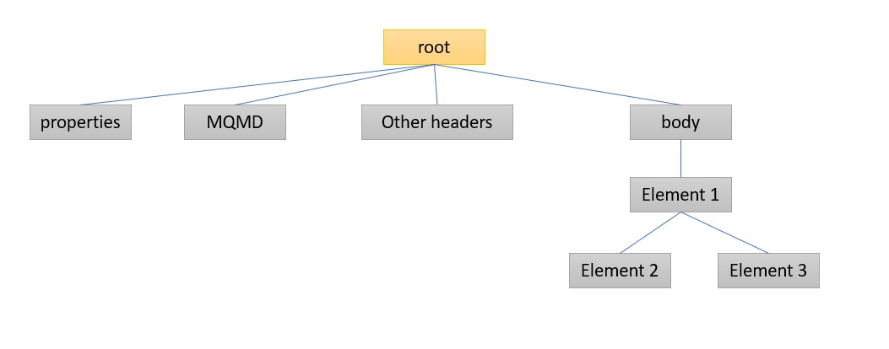
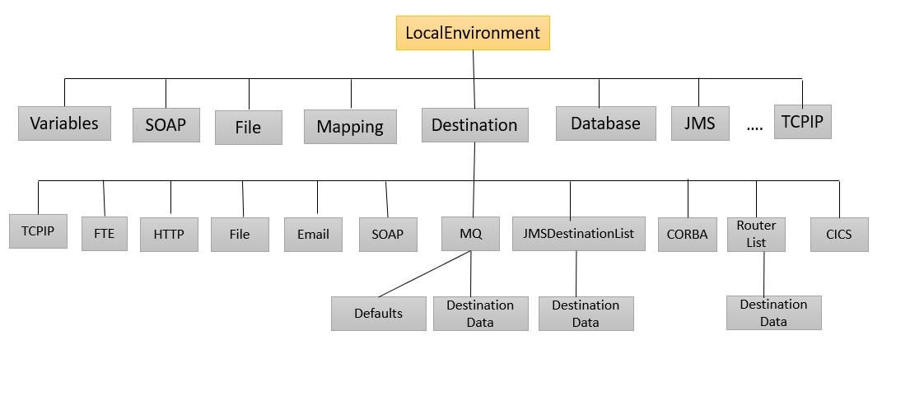

Transformation to the messages can be achieved in multiple ways in IIB. 

When a message arrives to IIB, it represents the input in logical tree structure which is the internal representation of a message(also known as message assembly).

Message will be interpreted by one or more parsers, and input node creates 4 tree structures.

### 1. Message Tree

### 2. Environment tree

### 3. Local Environment tree

### 4. Exception tree

Root of exception tree is `ExceptionList`. There can be one or more childs to ExceptionList which can be any of the below:

* FatalException
* RecoverableException
* ConfigurationException
* SecurityException
* ParserException
* ConversionException
* DatabaseException
* UserException
* CastException
* MessageException
* SqlException
* SocketException
* SocketTimeoutException
* UnknownException

In addition to the below, IIB supports other programming/scriping languages like .net, c#, PHP,XSL etc to perform data transformation, routing or data en-richment.

## Using compute node

* ESQL(Extended Structured Query Language) is used to write business logic in compute, filter and database nodes.

* Compute node constructs one or more output messages.

* Compute node is used to 
    * Transform the message from one format to another
    * copy messages between parsers
    * to convert messages from one codeset to another.

* Change the compute node property based on the message trees you use in the code.

|Compute Mode	| Trees propagated|
|---|---|
|All	|OutputRoot, OutputLocalEnvironment, OutputExceptionList|
|Message	| OutputRoot, InputLocalEnvironment, InputExceptionList|
|LocalEnvironment	| InputRoot, OutputLocalEnvironment, InputExceptionList|
|LocalEnvironment and Message	| OutputRoot, OutputLocalEnvironment, InputExceptionList|
|Exception	| InputRoot, InputLocalEnvironment, OutputExceptionList|
|Exception and Message	| OutputRoot, InputLocalEnvironment, OutputExceptionList|
|Exception and LocalEnvironment	| InputRoot, OutputLocalEnvironment, OutputExceptionList|

*  Compute Node terminals and it's description:

|Terminal|	Description|
|----|----|
|In|	to receive input message|
|Failure | Input message is routed here if an unhandled exception occurs |
|Out	| To send the output message constructed|
|Out1	| The first alternative output terminal where the constructed output might be routed by a PROPAGATE statement.|
|Out2	| The second alternative output terminal where the constructed output might be routed by a PROPAGATE statement.|
|Out3	| The third alternative output terminal where the constructed output might be routed by a PROPAGATE statement.|
|Out4	| The fourth alternative output terminal where the constructed output might be routed by a PROPAGATE statement.|

## Using Graphical data mapping editor

You can transform the message graphically with out writing code using message maps.

* Input object will appear on left and output on right.

* Create connections by clicking grab handle, which can be seen when you point on a element and drag the mouse to connect to the target output element.

* There are many tranform in-built functions which can be used for writing logic.

## Using Java compute node

* Java is used to route, transform or enrich the message it received.

* Java compute node is similar to compute node but uses java instead of ESQL

## Using ITX map

IBM transformation extender(ITX) map can be integrated with IBM Integration Bus(IIB) using map node in the message flow.

* ITX map can have multiple input and output cards. But, ITX map node has only one input terminal. Hence you can pass only input from IIB flow to ITX map.

* ITX map cards which didn't receive input from IIB flow will take the settings configured at input card settings.

* ITX map can have multiple output cards, you can select which cards output to connect to other message nodes.

