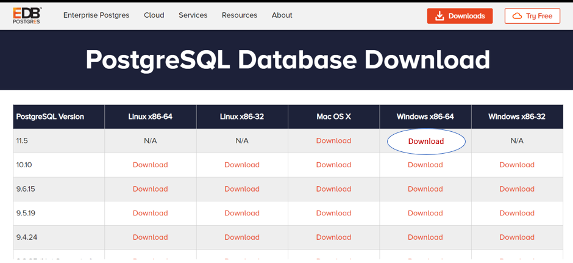
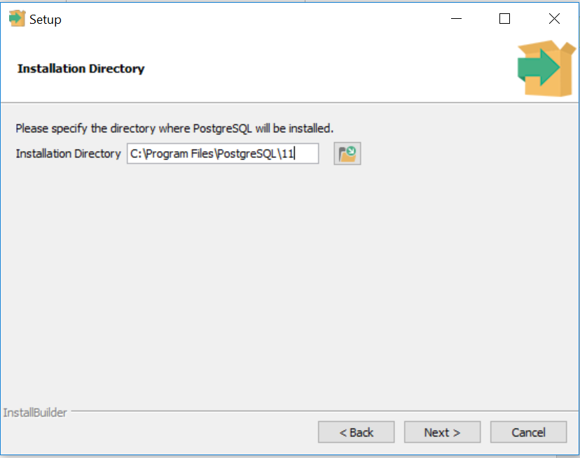
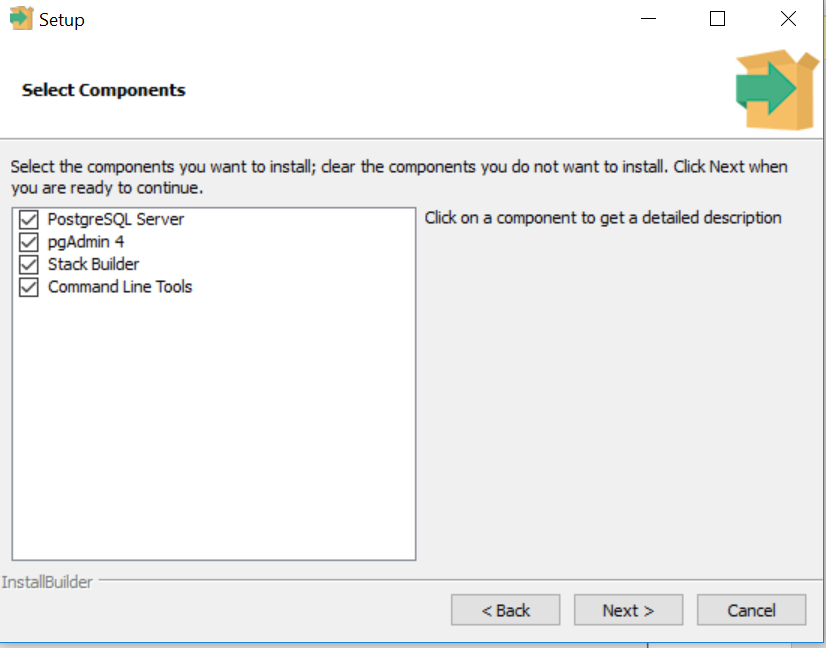
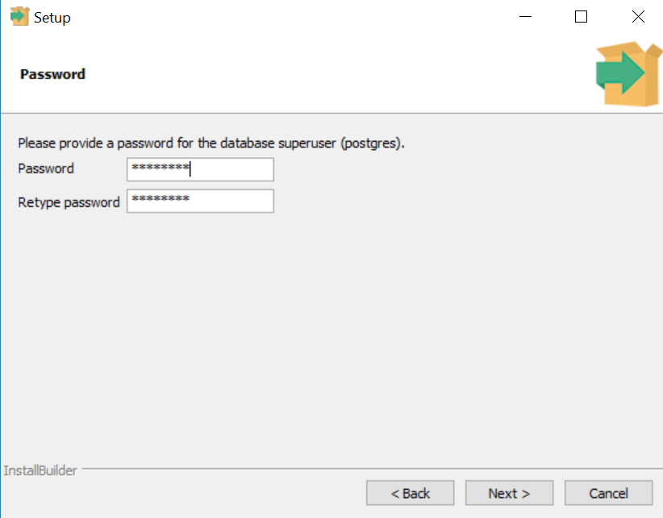
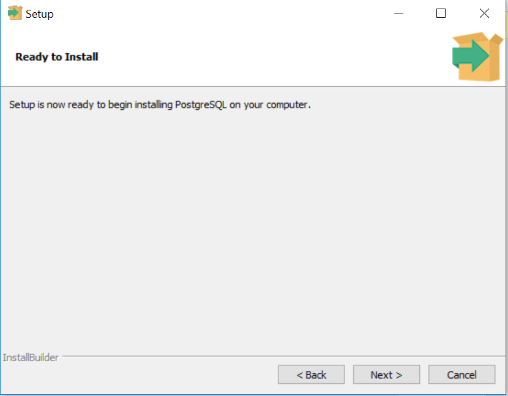
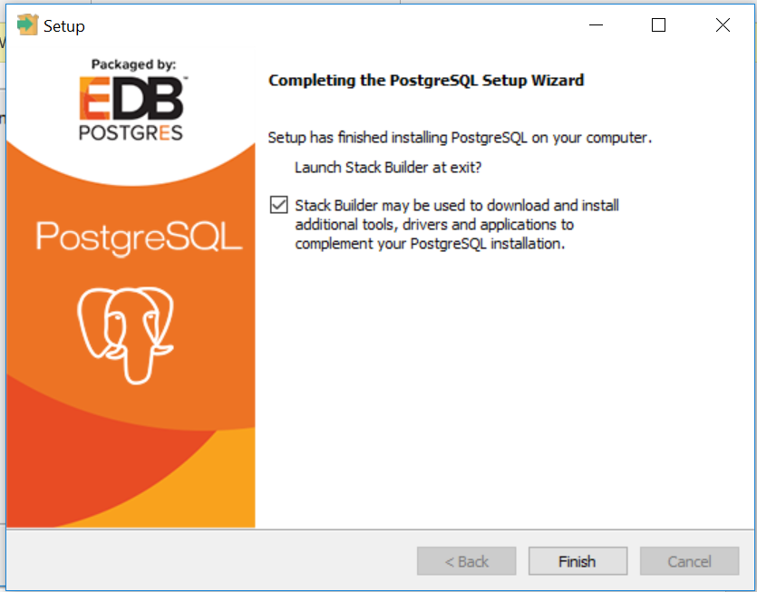

## Installation on Linux

1. Download the required version from [EnterpriseDB](https://www.enterprisedb.com/downloads/postgres-postgresql-downloads)
2. Login as root and execute below commands
    ```
    [root@host]# chmod +x postgresql-10.10-1-linux-x64.run
    [root@host]# ./postgresql-10.10-1-linux-x64.run
    ```
3. Provide location, port number, password of the username etc., to complete the installation. 

## Installation on Windows

1. Download the required version from [EnterpriseDB](https://www.enterprisedb.com/downloads/postgres-postgresql-downloads)

2. Run the executable file and specify the installation directory.

3. Select the components as per your requirement. Stack Builder is used to download additional components for future purpose.

4. Provide the password.

5. provide port number

6. Setup is ready now to start the installation process.

7. Installation takes few minutes to complete.

8. Verify the installation.
    * Open psql
    * Provide servername, database name, port number, user name and password which you have provided during installation.
    * Check the version using 
        ```sql
        select version();
        ```
        

## Connect to database

1. open pgadmin 4
2. provide password
3. If server is not already available, create by right clicking on Servers and provide hostname, username and passsword.
    
4. Open Querytool by right clicking on the database you created.
    
